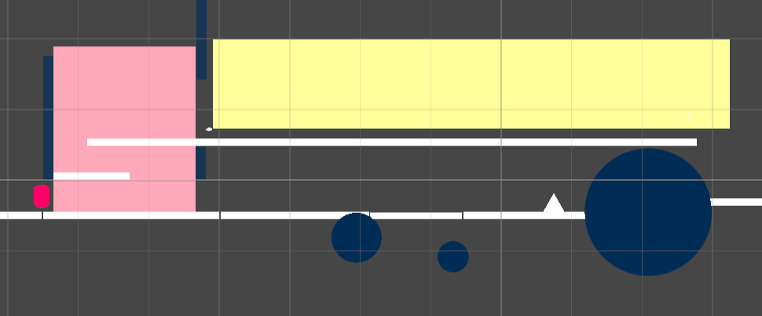
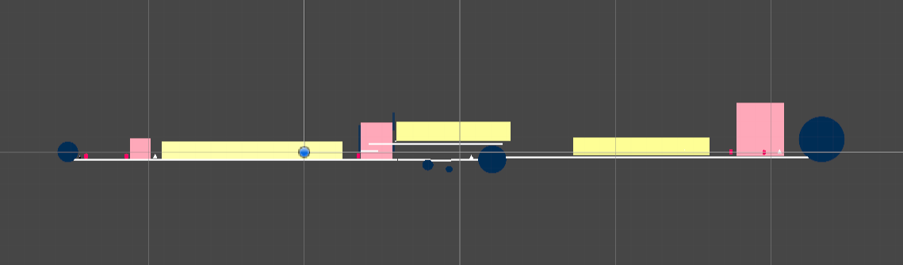

# BLACKOUT

*An exploration of an audio based 2D platformer*

---

## Table of Contents

- [Overview](#overview)
- [Screenshots](#screenshots)
- [Controls](#controls)<!--- [Design Notes](#design-notes)-->
- [Installation](#installation)

---

## Overview

- **Genre:** 2D Platformer Prototype
- **Story:** A messenger journeys from their home church to a neighboring church using audio clues for navigation
- **Objective:** To get to the far church of Compensatia
- **Key Features:** This game is an audio based 2D navigation experience, this means jumping is required to progress, as is using surface audio feedback and character sounds for feedback.

---

## Screenshots

### Screenshot 1: Primary Friction Point Of Sightless Navigation

### Screenshot 2: Level Overview

---

## Controls

### Keyboard Controls
- **A / Left Arrow:** Move Left
- **D / Right Arrow:** Move Right
- **Spacebar:** Jump 

- **O / TurnOff BlackOut overlay:** 

---
<!--
## Design Notes

Include additional details that provide insight into your design and development decisions. This might include:

- **Art & Sound Direction:** Short notes on the visual style, music, sound effects, or any unique artistic choices.
- **Game Mechanics:** Briefly describe any innovative mechanics or systems implemented.
- **Challenges Faced:** Any noteworthy hurdles during development and how you approached them.
- **Future Plans:** Ideas or planned features for subsequent iterations of the game prototype.
---
-->
## Installation

Run Build From Builds Folder
